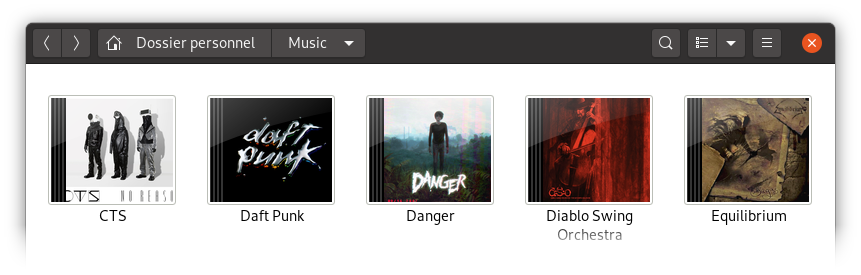
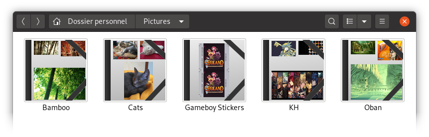
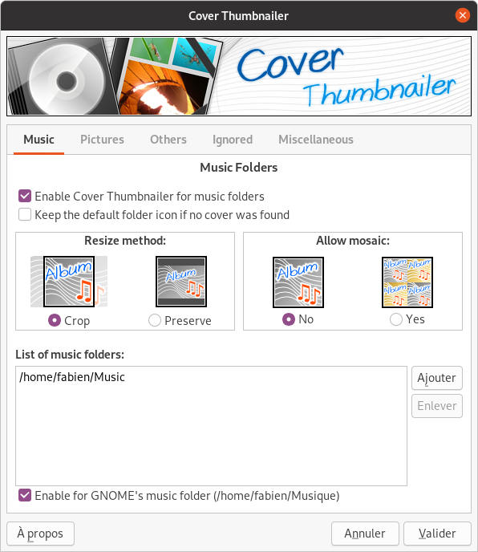
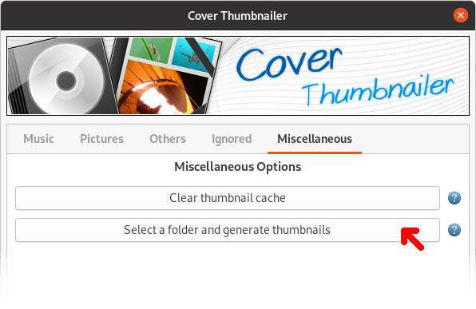

# Cover Thumbnailer

**Cover thumbnailer** generates folder thumbnails for various file browser on
Linux. It displays music album covers, preview of pictures which are in
a folder and more.

Example with a music folder:

Example with a picture folder:

Cover Thumbnailer is free software distributed under the GNU GPL v3+ license,
you are free to modify and redistribute it under the terms of the license.

> This repository is the continuation of the [Bazaar / Launchpad][lp] one. This
> project is in "maintenance mode": no new feature will be added, only fixes
> will be released when possible.

> If You are a developer and want to continue the development of this software,
> please [contact me][contact].

[lp]: https://launchpad.net/cover-thumbnailer
[contact]: https://contact.flozz.fr/

## Supported file browsers

As far as I know, Cover Thumbnailer currently works with the following file
browsers:

* Nautilus¹ (GNOME file browser)
* Thunar (XFCE file browser)
* Caja (MATE file browser)
* Nemo (Cinnamon file browser)

----

**NOTE¹: Nautilus support**

Since Nautilus started sandboxing thumbnailers, Cover Thumbnailer do not work
out of the box with this file borwser anymore. A button have been added to the
configuration GUI to generate manually the thumbnails for a specific folder,
see bellow.

## How does it work?

How Cover Thumbnailer decides what to display on a folder? It depends on the type of the folder and your configuration.

By default, Cover Thumbnailer will detect your main "Music" and "Pictures" folders using the XDG configuration file (`~/.config/user-dirs.dirs`). You can disable this and / or add other folders using the graphical configuration tool (see bellow).

### Music folders

If Cover Thumbnailer is **enabled for music folders** (it is the case by default) and the current folder is recognized as a music folder, the generated thumbnail will looks like a CD case, with zero, one or more cover on it depending on found pictures and user configuration.

#### In short

Just put an image with a name like `cover.png/jpg`, `.cover.png/jpg`, `folder.png/jpg` in the folder, and it should work.

#### In detail

Cover Thumbnailer will first look in the folder itself if an image with one of the following name exists (it searches in this precise order) :

    cover.png   cover.jpg   .cover.png   .cover.jpg
    Cover.png   Cover.jpg   .Cover.png   .Cover.jpg
    folder.png  folder.jpg  .folder.png  .folder.jpg
    Folder.png  Folder.jpg  .Folder.png  .Folder.jpg

If yes it will use **this** image to generate the thumbnail.

If there is no file matching one of the name above, it will search for any picture in a supported format (see "Pictures folders" documentation bellow for a list) in the folder and by default it will use the first one it found, or up to four pictures if the `Allow mosaic` option is enabled.

If there is still no picture found, it will then search recursively for it and will use the first one or up to four pictures depending of the `Allow mosaic` option.

If definitively no picture was found, it will display an empty CD case (or the default folder icon depending of your configuration).

### Pictures folders

If Cover Thumbnailer is **enabled for pictures folders** (it is the case by default) and the current folder is recognized as a pictures folder, the generated thumbnail will looks like a portfolio, and up to four pictures found in the folder will be displayed on it.

#### In short

If any pictures are available in the folder (or its subfolders), they will be used in the thumbnail.

#### In detail

First, Cover Thumbnailer will look for pictures in any supported format (list bellow) in the folder. If it find at least one, it will stops its search here and will display up to four pictures in the thumbnail, depending of what was found and your configuration (by default it will display up to tree pictures).

If no images were found, it will then search recursively in the folder.

If there is still no picture found, it will display an empty portfolio or the default folder icon depending of your configuration.

List of supported images formats / extensions:

* `.jpg`, `.JPG`, `jpeg`, `JPEG`,
* `.png`, `.PNG`,
* `.gif`, `.GIF`,
* `.bmp`, `.BMP` (Window ans OS/2 bitmap),
* `.ico`, `.ICO` (Windows icon format),
* `.tga`, `.TGA` (Truevision Targa format),
* `.tif`, `.TIF`, `tiff`, `TIFF` (Adobe Tagged Image File Format),
* `.psd`, `.PSD` (#Adobe Photosop format, only version 2.5 and 3.0).

### Other folders

If Cover Thumbnailer is **enabled for other folders** (it is the case by default), Cover Thumbnailer will search in the folder for a file with a name like `cover/folder.png/jpg` (same list than for the music).

## Installing Cover Thumbnailer

### Requirements

Cover Thumbnailer dependencies:

* PIL / pillow
* Python bindings for GObject Introspection
* Introspection files for GTK 3.0
* GNU gettext

On **Debian** / **Ubuntu**, this can be installed using the following command:

    sudo apt install gettext python3-pil python3-gi gir1.2-gtk-3.0

On **Fedora**, you can install the dependencies using this command:

    sudo dnf install git gettext python3-pillow python3-gobject

On **Arch Linux** and **Manjaro**, the command to install requirements is:

    sudo pacman -S git gettext gtk3 python-pillow

### Install from source

Clone this repository or [download a zip][gh-zip] from Github:

    git clone https://github.com/flozz/cover-thumbnailer.git

Go to the project folder:

    cd cover-thumbnailer/

Install Cover Thumbnailer using the following command:

    sudo ./install.sh --install

[gh-zip]: https://github.com/flozz/cover-thumbnailer/archive/master.zip

### Ubuntu PPA

There use to be a PPA for Ubuntu, but it is not up to date anymore, please do
not use it.

**You have to uninstall the package from the PPA before installing Cover
Thumbnailer from the sources.**

### Archlinux AUR

There is a package in AUR for Archlinux:

* https://aur.archlinux.org/packages/cover-thumbnailer/

## Uninstalling Cover Thumbnailer

To uninstall Cover thumbnailer, run the following command:

    sudo /usr/share/cover-thumbnailer/uninstall.sh --remove

## Configuring Cover Thumbnailer

Cover Thumbnailer provides a graphical tool to configure it. You will find it
in your application launcher like any other software.

You can also run it with the following command:

    cover-thumbnailer-gui

The configuration tool will write the configuration in the
`~/.cover-thumbnailer/cover-thumbnailer.conf` file. It is a plain-text file, so
you can also edit it manually.

## Generating Thumbnails

If you are using **Thunar**, **Caja**, or **Nemo**, it should work out of the
box: just open a folder and thumbnails should be generated automatically.

If you are using **Nautilus**, thumbnails cannot be generated automatically in
most recent version of this file browser. You can generate thumbnails manually
using the configuration tool: in the last tab, just click the `"Select a folder
and generate thumbnails"` button.

**NOTE:** The thumbnail generation could take a while, just be patient. The
thumbnails should appear after a refresh of the folder.

## Changelog

* **[NEXT]** (changes on `master` but not released yet):

  * Nothing yet ;)

* **v0.10.2 (2024-12-14):**

  * fix: Fixed bad regex escape sequence (@Caellian, #21)
  * feat: Added pyproject.toml (@Caellian, #22)

* **v0.10.1 (2023-07-31):**

  * Added Pillow >= 10.0 compatibility by replacing deprecated `PIL.Image.ANTIALIAS` constant by `PIL.Image.LANCSZOS` (@flozz, #16)

* **v0.10.0 (2020-07-12):**

  * Port from Python 2 to Python 3
  * Port the config GUI from GTK 2 (PyGTK) to GTK 3 (GObject Introspection)
  * Adds a button to generates manually the thumbnails (required for Nautilus)
  * Support of Thunar, Caja, and Nemo
  * Update translations
  * various fixes

* **v0.8.4:** Old version imported to github
